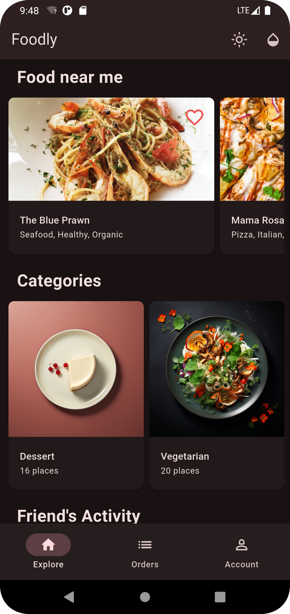

# Flutter Food Delivery Application

A cross-platform food delivery application built using Flutter and Dart. This project demonstrates a modern approach to developing scalable and maintainable mobile apps for food delivery services.

## Table of Contents

- [Demo](#Demo)
- [Features](#features)
- [Getting Started](#getting-started)
- [Project Structure](#project-structure)
- [Contributing](#contributing)
- [License](#license)
- [Author](#author)

## 📸 Demo

| Home 1                                   | Home 2                                   | Login                                      | Booking                                    |
| ---------------------------------------- | ---------------------------------------- | ------------------------------------------ | ------------------------------------------ |
|  |  |  |  |

| Home                                 | Doctor List                                | Profile                                    | Booking                                    |
| ------------------------------------ | ------------------------------------------ | ------------------------------------------ | ------------------------------------------ |
|  |  |  |  |

## Features

- User-friendly and modern interface for browsing restaurants and menus.
- Support for user authentication and profile management.
- Real-time order tracking and status updates.
- Secure checkout and payment integration.
- Restaurant and food item search functionality.
- Responsive design for Android and iOS.

## Getting Started

To run this project locally:

1. **Clone the repository:**
    ```bash
    git clone https://github.com/TareqAlKushari/Flutter-Food-Delivery-Application.git
    cd Flutter-Food-Delivery-Application
    ```

2. **Install dependencies:**
    ```bash
    flutter pub get
    ```

3. **Run the application:**
    ```bash
    flutter run
    ```

> **Note:** Ensure you have Flutter installed. See the [Flutter installation guide](https://flutter.dev/docs/get-started/install) for details.

## Project Structure

A typical Flutter project structure may include:

- `lib/` — Main source code directory
- `lib/main.dart` — Entry point of the application
- `lib/screens/` — UI screens and pages
- `lib/models/` — Data models
- `lib/services/` — Business logic and backend communication
- `assets/` — Images, fonts, and other assets

> For detailed file organization, refer to the source code in this repository.

## Contributing

Contributions are welcome! Please open issues or submit pull requests for improvements and bug fixes.

## License

This project is licensed under the MIT License. See the [LICENSE](LICENSE) file for details.

## Author

Developed by [Tareq Al Kushari](https://github.com/TareqAlKushari).

---
